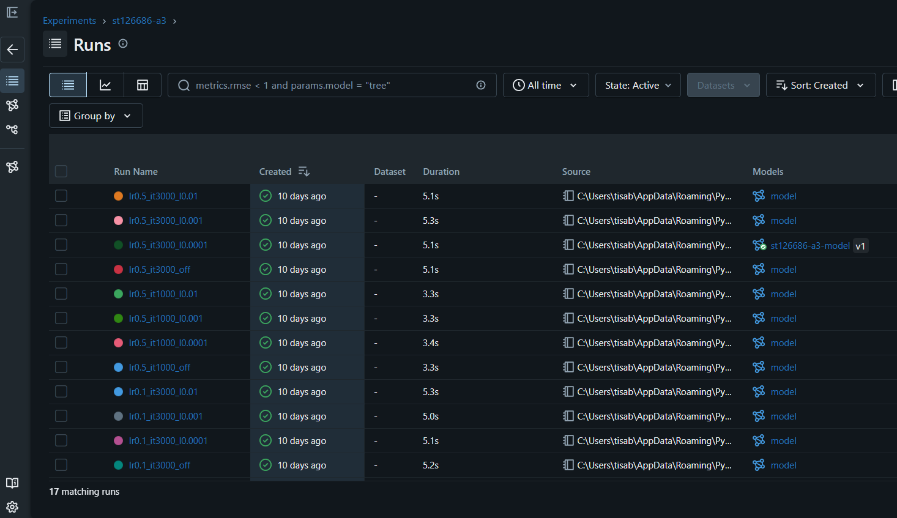
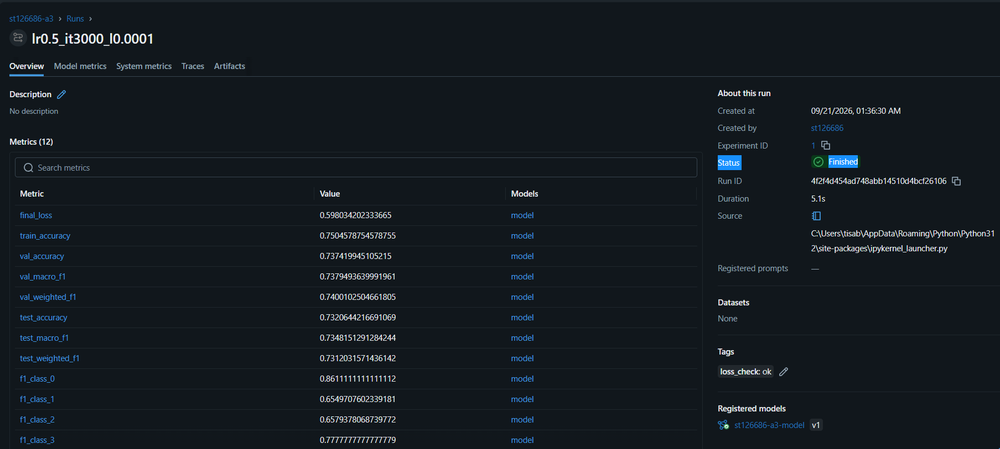
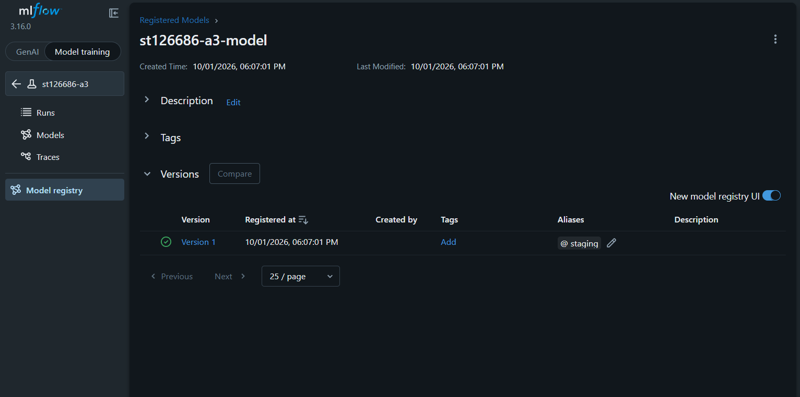

# A3: Predicting Car Price (Classification)

Multinomial logistic regression written from scratch, predicting which of four price
classes a used car falls into. It builds on the cleaning and preprocessing from A1 and A2,
with the price turned into four classes instead of a number.

## Final model

Learning rate 0.5, 3000 iterations, ridge penalty with lambda_ 0.0001. The run name in MLflow
is `lr0.5_it3000_l0.0001`.

| Metric | Validation | Test |
|---|---|---|
| macro f1 | 0.7379 | 0.7348 |

## Contents

- `A3_Predicting_Car_Price.ipynb` — the logistic regression class, the metrics, the
  experiment and the report
- `app/` — Dash application (`app.py`, `pages/`, `logistic_regression.py`, `requirements.txt`)
- `model/` — saved model, preprocessor and price class edges
- `tests/` — the two unit tests
- `screenshots/` — the MLflow screenshots
- `Dockerfile`, `docker-compose.yaml`, `docker-compose-deploy.yaml`, `.dockerignore`
- `pytest.ini`, `requirements.txt`, `Cars.csv`

## What the notebook does

**Task 1, metrics.** Accuracy, precision, recall and f1 per class, plus the macro and
weighted averages, all written by hand. I checked every number against scikit-learn's
`classification_report` and they match (the difference is 0.0 on both the validation and
the test set).

"Support" is the number of cars in each class in the true labels. It is how many examples
the other numbers in that row are based on. The weighted average uses it as the weight, so a
big class counts for more. The macro average ignores it and gives every class the same say.

**Task 2, ridge penalty.** The penalty is off by default. It is switched on with
`use_penalty=True`, and `lambda_` sets the strength (it has a trailing underscore because
`lambda` is a Python keyword). The loss is the mean cross entropy plus
`lambda_ * sum(weights ** 2)`. Two choices to know about:

- `lambda_` is not divided by the number of samples, so it is on the same scale as the
  average loss.
- The bias weights are not penalized, only the feature weights.

**Task 3, experiments and MLflow.** I ran 16 combinations of learning rate (0.1, 0.5),
iterations (1000, 3000) and penalty (off, or lambda_ 0.0001, 0.001 or 0.01), and logged each
one. With the baseline run, the local MLflow experiment holds 17 runs in total.

The course MLflow server was unstable, so, following the instructor's update, I logged the
experiments to a local MLflow instance instead. The required screenshots are in
`screenshots/`:

`mlflow_runs_overview.png` — the list of runs in the `st126686-a3` experiment

`mlflow_best_run_metrics.png` — the best run, `lr0.5_it3000_l0.0001`, with its metrics

`mlflow_model_registry.png` — the registered model `st126686-a3-model`, version 1, with
the `staging` alias

The best run by validation macro f1 was `lr0.5_it3000_l0.0001`: 0.7379 on validation and
0.7348 on the test set. The top six runs were all within about 0.003 of each other on
validation, so the choice between them is not a strong one.

## Running the app locally

Requires Docker Desktop. From this folder:

    docker compose up --build

Then open http://localhost:8050. To stop it, press Ctrl+C or run `docker compose down`.

## CI/CD

Unit tests run on GitHub Actions on every push. If they pass, the app is deployed
automatically. If they fail, nothing is deployed.

## Running the tests

From this folder:

    pip install -r requirements.txt
    pytest

There are two tests. One checks that the model accepts the 41 column input the app sends.
The class has no explicit input check, but numpy raises a ValueError on the matrix
multiplication if the column count does not match, and the test confirms that. The other
checks that the output has the right shape, with one class from 0 to 3 per row and
probabilities that add up to 1. They use made-up data, so they need neither MLflow nor
`Cars.csv`.

## Known issues

The course MLflow server and the Docker network on the deployment VM were both affected by
infrastructure problems during this assignment. I confirmed this with the course staff. The
model was validated locally and works correctly.

The GitHub Actions deploy job was tested and completes every step (SSH connection through
the jump host, image pull, container creation) but fails at the final network attachment
step with the same "invalid cluster node while attaching to network" error seen in manual
testing. This confirms the failure comes from the VM's broken Docker network and not from
the CI/CD pipeline. The unit test job passes. This is visible under the repository's
Actions tab as run #1, titled 'Trigger CI/CD workflow'.

<!-- CI/CD pipeline verified -->
